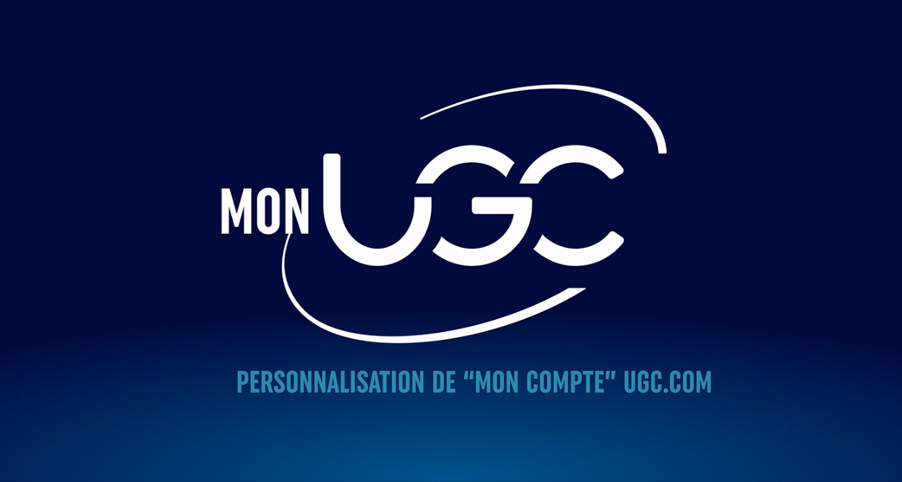

<h1 align="center">Bonjour 👋, je m'appelle Bastien Stacherski</h1>

<h3 align="center">Un développeur back-end passionné !</h3>

- 🔭 Je travaille actuellement sur le projet "**Mon UGC**"

- 👨‍💻 Tous mes projets sont disponibles sur [mon portfolio](https://bast4u.github.io/portfolio/index.html#projects)

- 📫 Comment me contacter **bastien.stacherskipro@gmail.com**

<h3 align="left">Connect with me:</h3>

<h3 align="left">Languages and Tools:</h3>

          

<h2 align="center">Mon dernier projet en date</h2>

	<table>
		<tr>
			<td width="50%">
				<h3 align="center">Mon UGC</h3>
				
  
					
					  
					

						
						
					

					
<strong> PHP - Symfony - Mongodb - Javascript - API - Git </strong>

					

					Ce projet est le fruit d'un travail collaboratif entre 4 UI/UX designers et 4 développeurs. Notre objectif est celui d'une refonte de l'espace "Mon Compte" sur le site UGC, avec l'ajout lors de l'inscription, de préférences telles que le genre du film, les acteurs, les réalisateurs ou encore le cinéma. Cela permet à l'utilisateur de pouvoir visualiser les films actuellement au cinéma selon ses préférences   
					<b> Ce projet est toujours en cours de développement. </b>
					

				

            </td>
        </tr>
	</table>

